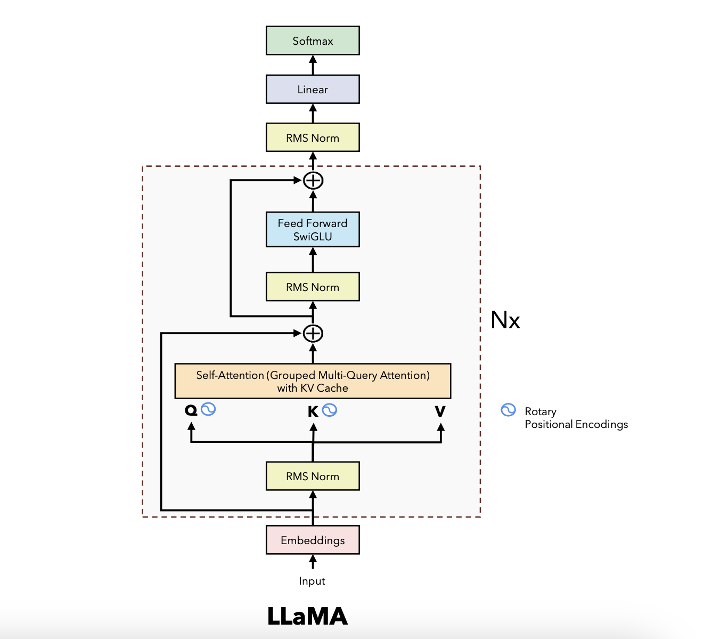

# llama2

This repository contains an implementation of the LLaMA 2 (Large Language Model Meta AI) model, a Generative Pretrained Transformer (GPT) variant. The implementation focuses on the model architecture and the inference process. The code is restructured and heavily commented to facilitate easy understanding of the key parts of the architecture.


## Installation for llama2 pre_trained
1. From this link [llama2](https://ai.meta.com/resources/models-and-libraries/llama-downloads/)
you can start enter your information then choose the model want to use and just will get the link then copy
after copying the link run "download.sh" and enter your email and the linked copied
```bash
#!/bin/bash

# Copyright (c) Meta Platforms, Inc. and affiliates.
# This software may be used and distributed according to the terms of the Llama 2 Community License Agreement.

read -p "Enter the URL from email: " PRESIGNED_URL
echo ""
read -p "Enter the list of models to download without spaces (7B,13B,70B,7B-chat,13B-chat,70B-chat), or press Enter for all: " MODEL_SIZE
TARGET_FOLDER="."             # where all files should end up
mkdir -p ${TARGET_FOLDER}

if [[ $MODEL_SIZE == "" ]]; then
    MODEL_SIZE="7B,13B,70B,7B-chat,13B-chat,70B-chat"
fi

echo "Downloading LICENSE and Acceptable Usage Policy"
wget ${PRESIGNED_URL/'*'/"LICENSE"} -O ${TARGET_FOLDER}"/LICENSE"
wget ${PRESIGNED_URL/'*'/"USE_POLICY.md"} -O ${TARGET_FOLDER}"/USE_POLICY.md"

echo "Downloading tokenizer"
wget ${PRESIGNED_URL/'*'/"tokenizer.model"} -O ${TARGET_FOLDER}"/tokenizer.model"
wget ${PRESIGNED_URL/'*'/"tokenizer_checklist.chk"} -O ${TARGET_FOLDER}"/tokenizer_checklist.chk"
(cd ${TARGET_FOLDER} && md5sum -c tokenizer_checklist.chk)

for m in ${MODEL_SIZE//,/ }
do
    if [[ $m == "7B" ]]; then
        SHARD=0
        MODEL_PATH="llama-2-7b"
    elif [[ $m == "7B-chat" ]]; then
        SHARD=0
        MODEL_PATH="llama-2-7b-chat"
    elif [[ $m == "13B" ]]; then
        SHARD=1
        MODEL_PATH="llama-2-13b"
    elif [[ $m == "13B-chat" ]]; then
        SHARD=1
        MODEL_PATH="llama-2-13b-chat"
    elif [[ $m == "70B" ]]; then
        SHARD=7
        MODEL_PATH="llama-2-70b"
    elif [[ $m == "70B-chat" ]]; then
        SHARD=7
        MODEL_PATH="llama-2-70b-chat"
    fi

    echo "Downloading ${MODEL_PATH}"
    mkdir -p ${TARGET_FOLDER}"/${MODEL_PATH}"

    for s in $(seq -f "0%g" 0 ${SHARD})
    do
        wget --retry-connrefused --waitretry=1 --read-timeout=20 --timeout=15 -t 0 --continue ${PRESIGNED_URL/'*'/"${MODEL_PATH}/consolidated.${s}.pth"} -O ${TARGET_FOLDER}"/${MODEL_PATH}/consolidated.${s}.pth"
    done

    wget ${PRESIGNED_URL/'*'/"${MODEL_PATH}/params.json"} -O ${TARGET_FOLDER}"/${MODEL_PATH}/params.json"
    wget ${PRESIGNED_URL/'*'/"${MODEL_PATH}/checklist.chk"} -O ${TARGET_FOLDER}"/${MODEL_PATH}/checklist.chk"
    echo "Checking checksums"
    (cd ${TARGET_FOLDER}"/${MODEL_PATH}" && md5 -c checklist.chk)
done
```

2.Run the following command to install the required packages
using kaggle APIs
```bash
# Authenticate with credentials
export KAGGLE_USERNAME="username"
export KAGGLE_KEY="token"

# With Curl
curl -L -o ~/Downloads/model.tar.gz  https://www.kaggle.com/api/v1/models/google/gemma/pyTorch/2b/1/download -u $KAGGLE_USERNAME:$KAGGLE_KEY

# Download specific version (here version 1)
wget https://www.kaggle.com/api/v1/models/google/gemma/pyTorch/2b/1/download --user=$KAGGLE_USERNAME --password=$KAGGLE_KEY --auth-no-challenge
```

### Results and evaluation without any training
```bash
prompts = [
        "Simply put, the theory of relativity states that ",
        "If Google was an Italian company founded in Milan, it would",

        # Few shot prompt
        """Translate English to French:
        sea otter => loutre de mer
        peppermint => menthe poivrée
        plush girafe => girafe peluche
        cheese =>""",
        # Zero shot prompt
        """Tell me if the following person is actually Doraemon disguised as a human:
        Name: Ahmed Mustafa
        Decision: 
        """
    ]
```

answers
```bash
Simply put, the theory of relativity states that 1) time is relative to the observer, 2) mass is relative to the observer, 3) speed is relative to the observer, and 4) energy is relative to the observer. drywall repair cost per square foot
The Theory of Relativity is a theory that describes the relationship between space, time, and energy. It is based on the idea that the speed of light is the same for all observers. The theory was developed by Albert Einstein in 1905. The theory is based on the idea that the speed of light is the same for all
--------------------------------------------------
If Google was an Egyptation company founded in Cairo, it would be worth $10 billion.Khaled Diab
Google’s new headquarters in London is a five-storey glass box. Its rooftop garden is home to a variety of birds, insects and plants. It is a symbol of the company’s green credentials, but also a reminder that it is a business.
Google’s success is built on the premise that it knows what you want before you do. It knows what you are looking for, and it knows what you are searching for. It knows what you are watching, and
--------------------------------------------------
Translate English to Arabic:
        sea otter => ضاعة البحر
        peppermint => نعناع البحر 
        plush girafe => زرافة بيلوتشي
        cheese => براكين
        plush girafe => زرافة بيلوتشي
        cheese => براكين
        peppermint => نعناع البحر 
        sea otter
--------------------------------------------------
Tell me if the following person is actually Doraemon disguised as a human:
        Name: Ahmed Mustafa
        Decision:
        
        - The person is actually Doraemon disguised as a human.
        - The person is actually Doraemon disguised as a human.
        - The person is actually Doraemon disguised as a human.
        - The person is actually Doraemon disguised as a human.
        - The person is actually Doraemon disguised as a human.
        - The person is actually Doraemon disgu
--------------------------------------------------
```
## Code and Implementation Details

## Fine tune
