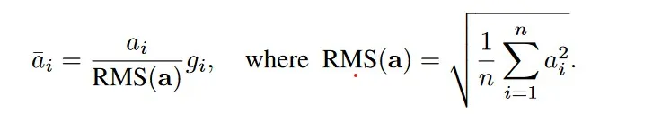
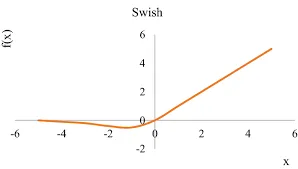
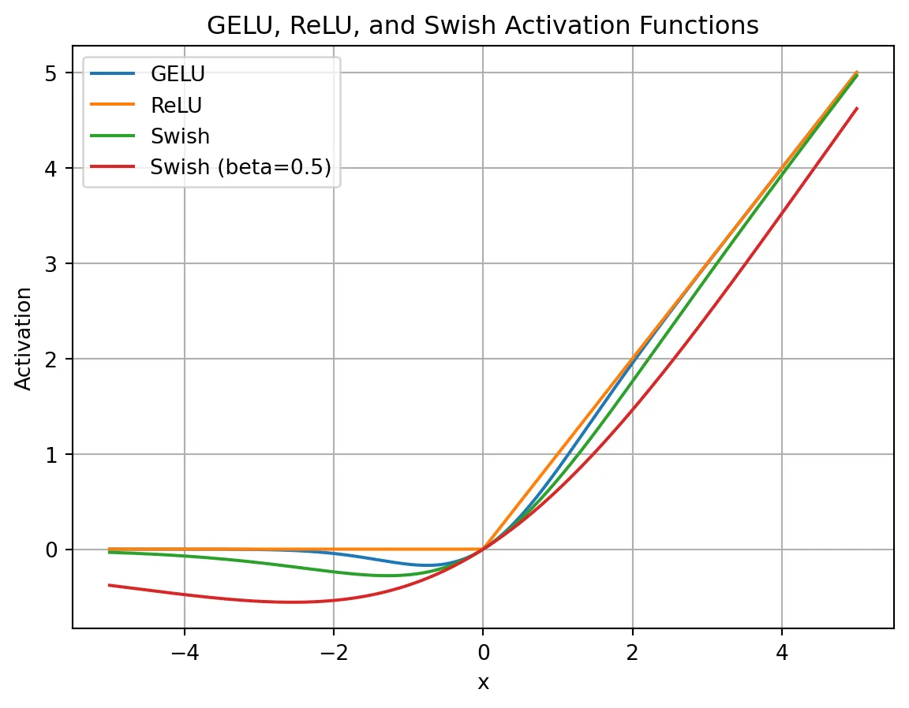
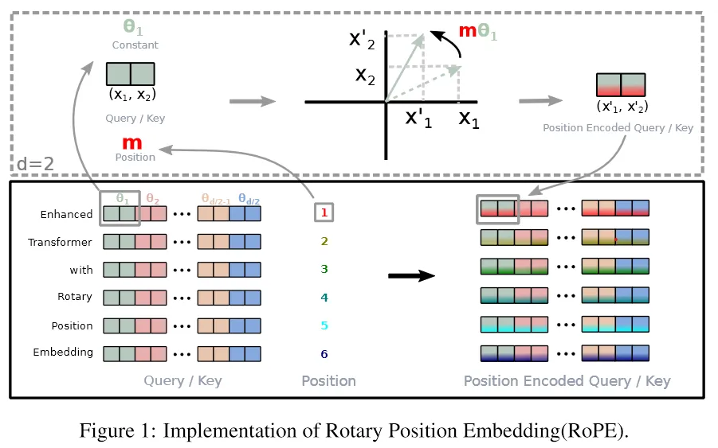
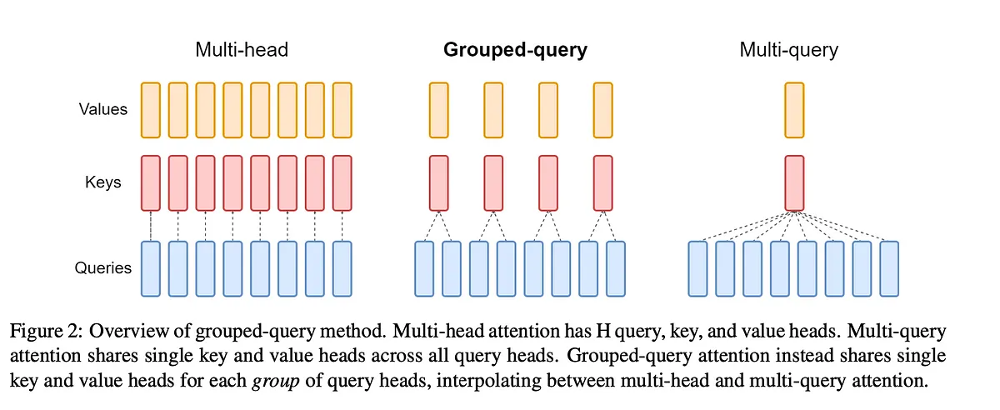
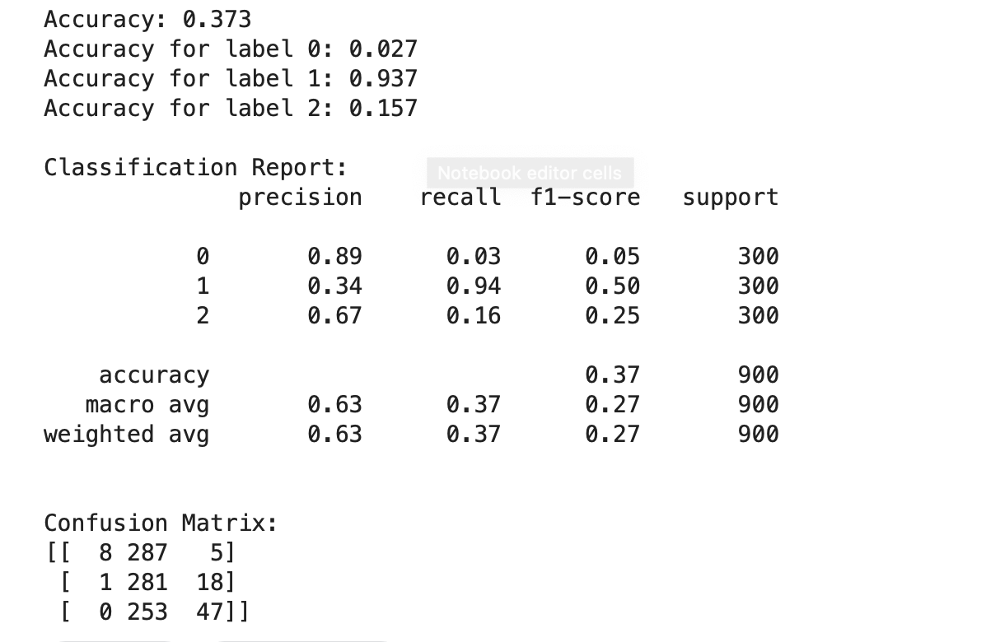
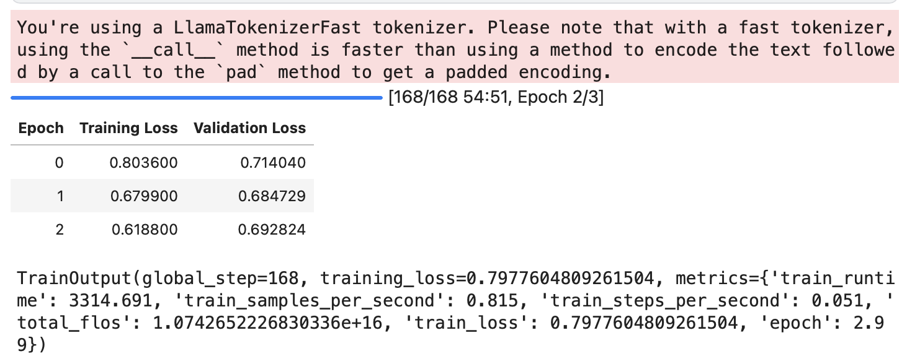
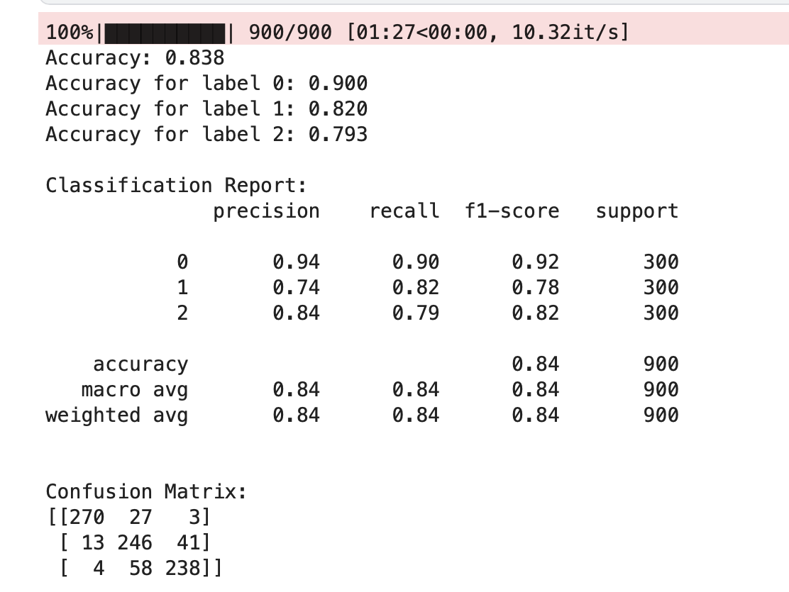

# llama2
[](https://colab.research.google.com/drive/1CY-uu9XgtmhktIDYLezhFSBc1u85BlgV?usp=sharing)


---------------------------------------
## Overview 
#### Explaining Everything from Scratch

•	Introduction: Outline the fundamental concepts and theories that underpin the project.
•	Model Architecture: Describe the model architecture, including its components and how they interact.

#### Using the Weights to Give Results

•	Pre-trained Weights: Discuss the significance of using pre-trained model weights and how they contribute to the initial results.
•	Initial Results: Present the results obtained using these weights and any insights gained from them.


#### Fine-Tuning for Sentiment Analysis

•	Fine-Tuning Process: Describe the steps involved in fine-tuning the model for sentiment analysis, including data preparation, training, and evaluation.
•	Results with Fine-Tuning: Compare the performance of the fine-tuned model with the base model.
•	Results without Fine-Tuning: Present results using the base model without fine-tuning for sentiment analysis.


#### Waiting for More Insights

•	Future Work: Highlight potential improvements, additional experiments, or future directions for the project.

---------------------------------------
---------------------------------------


source: [Umar Jamil](https://github.com/hkproj/pytorch-llama)

This repository contains an implementation of the LLaMA 2 (Large Language Model Meta AI) model, a Generative Pretrained Transformer (GPT) variant. The implementation focuses on the model architecture and the inference process. The code is restructured and heavily commented to facilitate easy understanding of the key parts of the architecture.

To properly format the mathematical equations in your README file, you can use LaTeX syntax, which is supported in Markdown by GitHub. Here's how you can represent the mathematical equations in your README file using GitHub-flavored Markdown with inline LaTeX formatting
## LLaMA Architecture Breakdown
1. Pre-normalization Using RMSNorm
RMSNorm : Root Mean Square Layer Normalization
LLaMA normalizes the input of each transformer sub-layer, instead of normalizing the output.
Inspiration of including pre-normalization is taken from GPT3.
RMSNorm is extension of Layer Normalization (LayerNorm). Reason behind using RMSNorm is the computational overhead in LayerNorm. This makes improvements slow and expensive. RMSNorm achieves comparable performance against LayerNorm but reduces the running time by 7%∼64%.
Let first understand LayerNorm, It has two properties.
a. re-centring : It make model insensitive to shift noises on both inputs and weights.
b. re-scaling: It keeps the output representations intact when both inputs and weights are randomly scaled.
RMSNorm claims that most of the benefits comes from re-scaling.
RMSNorm does re-scaling invariance and regularizes the summed
inputs simply according to the root mean square (RMS) statistic.

a_i : activation of ith neuron
g ∈ Rn is the gain parameter used to re-scale the standardized summed inputs
Intuitively, RMSNorm simplifies LayerNorm by totally removing the mean statistic in LayerNorm.
Feel free to take a look into the implementation of RMSNorm :
implementation of RMSNorm
```python
# coding=utf-8

from __future__ import absolute_import
from __future__ import division
from __future__ import print_function


import torch
import torch.nn as nn


class RMSNorm(nn.Module):
    def __init__(self, d, p=-1., eps=1e-8, bias=False):
        """
            Root Mean Square Layer Normalization
        :param d: model size
        :param p: partial RMSNorm, valid value [0, 1], default -1.0 (disabled)
        :param eps:  epsilon value, default 1e-8
        :param bias: whether use bias term for RMSNorm, disabled by
            default because RMSNorm doesn't enforce re-centering invariance.
        """
        super(RMSNorm, self).__init__()

        self.eps = eps
        self.d = d
        self.p = p
        self.bias = bias

        self.scale = nn.Parameter(torch.ones(d))
        self.register_parameter("scale", self.scale)

        if self.bias:
            self.offset = nn.Parameter(torch.zeros(d))
            self.register_parameter("offset", self.offset)

    def forward(self, x):
        if self.p < 0. or self.p > 1.:
            norm_x = x.norm(2, dim=-1, keepdim=True)
            d_x = self.d
        else:
            partial_size = int(self.d * self.p)
            partial_x, _ = torch.split(x, [partial_size, self.d - partial_size], dim=-1)

            norm_x = partial_x.norm(2, dim=-1, keepdim=True)
            d_x = partial_size

        rms_x = norm_x * d_x ** (-1. / 2)
        x_normed = x / (rms_x + self.eps)

        if self.bias:
            return self.scale * x_normed + self.offset

        return self.scale * x_normed
```

2.SwiGLU Activation Function
To understand SwiGLU activation function we need to understand Swish activation function.
Inspiration of using SwiGLU in LLaMA is taken from PaLM.

```python
def sigmoid(x):
  return  1/(1 + np.exp(-x))

def swish(x):
  return x*sigmoid(x)
```


Python Implementation of SwiGLU.
```python
class SwiGLU(tf.keras.layers.Layer):
    def __init__(self, bias=True, dim=-1, **kwargs):
        super(SwiGLU, self).__init__(**kwargs)
        self.bias = bias
        self.dim = dim
        self.dense = tf.keras.layers.Dense(2, use_bias=bias)

    def call(self, x):
        out, gate = tf.split(x, num_split=2, axis=self.dim)
        gate = tf.keras.activations.swish(gate)
        x = tf.multiply(out, gate)
        return x
```

* Smoothness: SwiGLU is smoother than ReLU, which can lead to better optimization and faster convergence.
* Non-monotonicity: SwiGLU is non-monotonic, which allows it to capture complex non-linear relationships between inputs and outputs



3.Rotary Embeddings (RopE)
RoPE, is a type of position embedding which encodes absolute positional information with rotation matrix and naturally incorporates explicit relative position dependency in self-attention formulation.
Advantage of RoPE
Can be expanded to any sequence lengths
Decaying inter-token dependency with increasing relative distances.
Capability of equipping the linear self-attention with relative position encoding.
The key idea is to encode relative position by multiplying the context
representations with a rotation matrix.
RoPE decays with the relative distance increased, which is desired for natural language encoding.

```python
   
class RotaryEmbedding(nn.Module):
    def __init__(self, d_model, max_len=512):
        super(RotaryEmbedding, self).__init__()
        self.d_model = d_model
        self.max_len = max_len
        self.freqs = 1 / 10000 ** (torch.arange(0, d_model, 2).float() / d_model)
        self.register_buffer("freqs", self.freqs)

    def forward(self, x):
        seq_len = x.size(1)
        pos = torch.arange(seq_len, device=x.device).float()
        freqs = self.freqs.view(1, -1, 1)
        pos = pos.view(-1, 1, 1)
        pos_embedding = torch.cat([torch.sin(pos * freqs), torch.cos(pos * freqs)], dim=-1)
        return pos_embedding
```
Inspiration of using RoPE in LLaMA is taken from GPTNeo.
Other important approaches used in paper are
Optimizer
AdamW optimizer (β1 = 0.9, β2 = 0.95) with cosine learning rate schedule. Weight decay of 0.1 and gradient clipping of 1.0 with 2000 warmup steps.
Efficient Implementations
Efficient implementation of the causal multi-head attention operator. Available in xformers library[5].
Manually implemented the backward function for the transformer layers to save costly activation during backward pass.

4.KV Cache
Key-Value (KV) caching is a technique used to accelerate the inference process in machine learning models, particularly in autoregressive models like GPT and Llama. In these models, 
generating tokens one by one is a common practice, but it can be computationally expensive because it repeats certain calculations at each step. To address this, KV caching comes into play. It involves caching the previous Keys and Values, so we don’t need to recalculate them for each new token. 
This significantly reduces the size of matrices used in calculations, making matrix multiplications faster. The only trade-off is that KV caching requires more GPU memory (or CPU memory if a GPU isn’t used) to store these Key and Value states.

Regarding the code, the KVCache class is responsible for handling this caching. It initializes two tensors, one for keys and one for values, both are initially filled with zeros. The update method is used to update the cache with new Key and Value information while the get method retrieves the cached Key and Value information based on the starting position and sequence length. This information can then be used for efficient attention calculations during token generation.
```python
class KVCache:
    def __init__(self, max_batch_size, max_seq_len, n_kv_heads, head_dim, device):
        self.cache_k = torch.zeros((max_batch_size, max_seq_len, n_kv_heads, head_dim)).to(device)
        self.cache_v = torch.zeros((max_batch_size, max_seq_len, n_kv_heads, head_dim)).to(device)

    def update(self, batch_size, start_pos, xk, xv):
        self.cache_k[:batch_size, start_pos :start_pos + xk.size(1)] = xk
        self.cache_v[:batch_size, start_pos :start_pos + xv.size(1)] = xv

    def get(self, batch_size, start_pos, seq_len):
        keys = self.cache_k[:batch_size,  :start_pos + seq_len]
        values = self.cache_v[:batch_size, :start_pos + seq_len]
        return keys, values
```
During inference, the process operates on one token at a time, maintaining a sequence length of one. This means that, for Key, Value, and Query, both the linear layer and rotary embedding exclusively target a single token at a specific position. The attention weights are precomputed and stored for Key and Value as caches, ensuring that these calculations occur only once and their results are cached. The script getmethod retrieves past attention weights for Key and Value up to the current position, extending their length beyond 1. During the scaled dot-product operation, the output size matches the query size, which generate only a single token.

5.Grouped Query Attention
Llama incorporates a technique called grouped-query attention (GQA) to address memory bandwidth challenges during the autoregressive decoding of Transformer models. The primary issue stems from the need to load decoder weights and attention keys/values at each processing step, which consumes excessive memory.
In response, two strategies are introduced: and .
Multi-query attention (MQA) involves utilizing multiple query heads with a single key/value head, which speeds up decoder inference. However, it has drawbacks such as quality degradation and training instability.
Grouped-Query attention (GQA), is an evolution of MQA and strikes a balance by using an intermediate number of key-value heads (more than one but fewer than the query heads). The GQA model efficiently breaks the query into n_heads segments like the original multi-head attention, and the key and value are divided into n_kv_headsgroups, enabling multiple key-value heads to share the same query.
By repeating key-value pairs for computational efficiency, the GQA approach optimizes performance while maintaining quality, as evidenced by the code implementation.

The provided code is for implementing grouped query attention (GQA) within the context of an autoregressive decoder using a Transformer model. Notably, during inference, the sequence length (seq_len) is always set to 1.
```python
def repeat_kv(x, n_rep):

    batch_size, seq_len, n_kv_heads, head_dim = x.shape
    if n_rep == 1:
        return x
    else:
        # (m, seq_len, n_kv_heads, 1, head_dim)
        # --> (m, seq_len, n_kv_heads, n_rep, head_dim)
        # --> (m, seq_len, n_kv_heads * n_rep, head_dim)
        return (
            x[:, :, :, None, :]
            .expand(batch_size, seq_len, n_kv_heads, n_rep, head_dim)
            .reshape(batch_size, seq_len, n_kv_heads * n_rep, head_dim)
        )

class SelfAttention(nn.Module):
    def __init__(self, config):
        super().__init__()

        self.n_heads = config['n_heads']
        self.n_kv_heads = config['n_kv_heads']
        self.dim = config['embed_dim']
        self.n_kv_heads = self.n_heads if self.n_kv_heads is None else self.n_kv_heads
        self.n_heads_q = self.n_heads
        self.n_rep = self.n_heads_q // self.n_kv_heads
        self.head_dim = self.dim // self.n_heads

        self.wq = nn.Linear(self.dim, self.n_heads * self.head_dim, bias=False)
        self.wk = nn.Linear(self.dim, self.n_kv_heads * self.head_dim, bias=False)
        self.wv = nn.Linear(self.dim, self.n_kv_heads * self.head_dim, bias=False)
        self.wo = nn.Linear(self.n_heads * self.head_dim, self.dim, bias=False)

        self.cache = KVCache(
            max_batch_size=config['max_batch_size'],
            max_seq_len=config['max_seq_len'],
            n_kv_heads=self.n_kv_heads,
            head_dim=self.head_dim,
            device=config['device']
        )

    def forward(self, x, start_pos, freqs_complex):

        # seq_len is always 1 during inference
        batch_size, seq_len, _ = x.shape

        # (m, seq_len, dim)
        xq = self.wq(x)

        # (m, seq_len, h_kv * head_dim)
        xk = self.wk(x)
        xv = self.wv(x)

        # (m, seq_len, n_heads, head_dim)
        xq = xq.view(batch_size, seq_len, self.n_heads_q, self.head_dim)

        # (m, seq_len, h_kv, head_dim)
        xk = xk.view(batch_size, seq_len, self.n_kv_heads, self.head_dim)
        xv = xv.view(batch_size, seq_len, self.n_kv_heads, self.head_dim)

        # (m, seq_len, num_head, head_dim)
        xq = apply_rotary_embeddings(xq, freqs_complex, device=x.device)

        # (m, seq_len, h_kv, head_dim)
        xk = apply_rotary_embeddings(xk, freqs_complex, device=x.device)

        # replace the entry in the cache
        self.cache.update(batch_size, start_pos, xk, xv)

        # (m, seq_len, h_kv, head_dim)
        keys, values = self.cache.get(batch_size, start_pos, seq_len)

        # (m, seq_len, h_kv, head_dim) --> (m, seq_len, n_heads, head_dim)
        keys = repeat_kv(keys, self.n_rep)
        values = repeat_kv(values, self.n_rep)

        # (m, n_heads, seq_len, head_dim)
        # seq_len is 1 for xq during inference
        xq = xq.transpose(1, 2)

        # (m, n_heads, seq_len, head_dim)
        keys = keys.transpose(1, 2)
        values = values.transpose(1, 2)

        # (m, n_heads, seq_len_q, head_dim) @ (m, n_heads, head_dim, seq_len) -> (m, n_heads, seq_len_q, seq_len)
        scores = torch.matmul(xq, keys.transpose(2, 3)) / math.sqrt(self.head_dim)

        # (m, n_heads, seq_len_q, seq_len)
        scores = F.softmax(scores.float(), dim=-1).type_as(xq)

        # (m, n_heads, seq_len_q, seq_len) @ (m, n_heads, seq_len, head_dim) -> (m, n_heads, seq_len_q, head_dim)
        output = torch.matmul(scores, values)

        # ((m, n_heads, seq_len_q, head_dim) -> (m, seq_len_q, dim)
        output = (output.transpose(1, 2).contiguous().view(batch_size, seq_len, -1))

        # (m, seq_len_q, dim)
        return self.wo(output)
```
SelfAttentionis a class that combines mechanism that we have discussed. The key components of this class are as follows:
Linear transformations are applied to the input tensor for queries (xq), keys (xk), and values (xv). These transformations project the input data into a form suitable for processing.
The rotary embedding is applied to the query and key tensors (but not the values) using the provided frequency complex number. This step enhances the model’s ability to consider positional information and perform attention computations.
The key-value pairs (k and v) are cached for efficient memory usage. The cached key-value pairs are retrieved up to current position (start_pos + seq_len)
The query, key, and value tensors are prepared for Grouped-Query attention calculation by repeating key-value pairs n_rep times, where n_rep corresponds to the number of query heads that share the same key-value pair.
Scaled dot-product attention computation. The attention scores are computed by taking the dot product of the query and key, followed by scaling. Softmax is applied to obtain the final attention scores. During the computation, the output size matches the query size, which is also 1.
Finally, the module applies a linear transformation (wo) to the output, and the processed output is returned.


6.Feedforward
In the Transformer architecture, the feedforward layer plays a crucial role, typically following the attention layer and normalization. The feedforward layer consists of three linear transformations.
The feedforward layer is a critical component of the Transformer architecture, responsible for processing the output of the self-attention layer. The feedforward layer consists of two linear transformations with a GELU activation function in between. The feedforward layer is applied to each token in the input sequence independently.
```python
class FeedForward(nn.Module):
    def __init__(self, config):

        super().__init__()

        hidden_dim = 4 * config['embed_dim']
        hidden_dim = int(2 * hidden_dim / 3)

        if config['ffn_dim_multiplier'] is not None:
            hidden_dim = int(config['ffn_dim_multiplier'] * hidden_dim)

        # Round the hidden_dim to the nearest multiple of the multiple_of parameter
        hidden_dim = config['multiple_of'] * ((hidden_dim + config['multiple_of'] - 1) // config['multiple_of'])

        self.w1 = nn.Linear(config['embed_dim'], hidden_dim, bias=False)
        self.w2 = nn.Linear(config['embed_dim'], hidden_dim, bias=False)
        self.w3 = nn.Linear(hidden_dim, config['embed_dim'], bias=False)

    def forward(self, x: torch.Tensor):
        # (m, seq_len, dim) --> (m, seq_len, hidden_dim)
        swish = swiglu(self.w1(x))
        # (m, seq_len, dim) --> (m, seq_len, hidden_dim)
        x_V = self.w2(x)

        # (m, seq_len, hidden_dim)
        x = swish * x_V

        # (m, seq_len, hidden_dim) --> (m, seq_len, dim)
        return self.w3(x)
```
During the forward pass, the input tensor x is subjected to multi layer of linear transformations. The SwiGLU activation function, applied after first transformation, enhances the expressive power of the model. The final transformation maps the tensor back to its original dimensions. This unique combination of SwiGLU activation and multiple FeedForward layer enhances the performance of the model.

7.Ultimate Transformer Model
The final culmination of Llama2, a powerful Transformer model, brings together the array of advanced techniques we’ve discussed so far. The DecoderBlock, a fundamental building block of this model, combines the knowledge of KV caching, Grouped Query Attention, SwiGLU activation, and Rotary Embedding to create a highly efficient and effective solution.
```python
class DecoderBlock(nn.Module):
    def __init__(self, config):
        super().__init__()

        self.n_heads = config['n_heads']
        self.dim = config['embed_dim']
        self.head_dim = self.dim // self.n_heads

        self.attention = SelfAttention(config)
        self.feed_forward = FeedForward(config)

        # rms before attention block
        self.attention_norm = RMSNorm(self.dim, eps=config['norm_eps'])

        # rms before  feed forward block
        self.ffn_norm = RMSNorm(self.dim, eps=config['norm_eps'])

    def forward(self, x, start_pos, freqs_complex):

        # (m, seq_len, dim)
        h = x + self.attention.forward(
            self.attention_norm(x), start_pos, freqs_complex)
        # (m, seq_len, dim)
        out = h + self.feed_forward.forward(self.ffn_norm(h))
        return out

class Transformer(nn.Module):
    def __init__(self, config):
        super().__init__()
        self.vocab_size = config['vocab_size']
        self.n_layers = config['n_layers']
        self.tok_embeddings = nn.Embedding(self.vocab_size, config['embed_dim'])
        self.head_dim = config['embed_dim'] // config['n_heads']

        self.layers = nn.ModuleList()
        for layer_id in range(config['n_layers']):
            self.layers.append(DecoderBlock(config))

        self.norm = RMSNorm(config['embed_dim'], eps=config['norm_eps'])
        self.output = nn.Linear(config['embed_dim'], self.vocab_size, bias=False)

        self.freqs_complex = precompute_theta_pos_frequencies(
            self.head_dim, config['max_seq_len'] * 2, device=(config['device']))

    def forward(self, tokens, start_pos):
        # (m, seq_len)
        batch_size, seq_len = tokens.shape

        # (m, seq_len) -> (m, seq_len, embed_dim)
        h = self.tok_embeddings(tokens)

        # (seq_len, (embed_dim/n_heads)/2]
        freqs_complex = self.freqs_complex[start_pos:start_pos + seq_len]

        # Consecutively apply all the encoder layers
        # (m, seq_len, dim)
        for layer in self.layers:
            h = layer(h, start_pos, freqs_complex)
        h = self.norm(h)

        # (m, seq_len, vocab_size)
        output = self.output(h).float()
        return output

model = Transformer(config).to(config['device'])
res = model.forward(test_set['input_ids'].to(config['device']), 0)
print(res.size())
```
The Transformer model encompasses a stack of DecoderBlocks to create a robust and efficient deep learning architecture. The accompanying code showcases how the DecoderBlock, with its SelfAttention, FeedForward, and RMSNorm layers, effectively processes data. The code also highlights the larger Transformer architecture’s structure, including token embeddings, layer stacking, and output generation. Furthermore, the use of precomputed frequencies and advanced techniques, combined with customized configurations, ensures the model’s remarkable performance and versatility in various natural language understanding tasks.
Conclusion
In this comprehensive journey through Llama2’s advanced techniques for Transformers, we’ve delved into both the theory and the intricate code implementation. However, it’s important to note that the code we’ve discussed is not primarily for training or production use but serves more as a demonstration and showcase of Llama’s remarkable inference ability. It highlights how these advanced techniques can be applied in a real-world context and showcases the potential of Llama2 in enhancing various natural language understanding tasks.


## Installation for llama2,3... pre_trained
1. From this link [llama2](https://ai.meta.com/resources/models-and-libraries/llama-downloads/)
you can start enter your information then choose the model want to use and just will get the link then copy
after copying the link run "download.sh" and enter your email and the linked copied
```bash
#!/bin/bash

# Copyright (c) Meta Platforms, Inc. and affiliates.
# This software may be used and distributed according to the terms of the Llama 2 Community License Agreement.

read -p "Enter the URL from email: " PRESIGNED_URL
echo ""
read -p "Enter the list of models to download without spaces (7B,13B,70B,7B-chat,13B-chat,70B-chat), or press Enter for all: " MODEL_SIZE
TARGET_FOLDER="."             # where all files should end up
mkdir -p ${TARGET_FOLDER}

if [[ $MODEL_SIZE == "" ]]; then
    MODEL_SIZE="7B,13B,70B,7B-chat,13B-chat,70B-chat"
fi

echo "Downloading LICENSE and Acceptable Usage Policy"
wget ${PRESIGNED_URL/'*'/"LICENSE"} -O ${TARGET_FOLDER}"/LICENSE"
wget ${PRESIGNED_URL/'*'/"USE_POLICY.md"} -O ${TARGET_FOLDER}"/USE_POLICY.md"

echo "Downloading tokenizer"
wget ${PRESIGNED_URL/'*'/"tokenizer.model"} -O ${TARGET_FOLDER}"/tokenizer.model"
wget ${PRESIGNED_URL/'*'/"tokenizer_checklist.chk"} -O ${TARGET_FOLDER}"/tokenizer_checklist.chk"
(cd ${TARGET_FOLDER} && md5sum -c tokenizer_checklist.chk)

for m in ${MODEL_SIZE//,/ }
do
    if [[ $m == "7B" ]]; then
        SHARD=0
        MODEL_PATH="llama-2-7b"
    elif [[ $m == "7B-chat" ]]; then
        SHARD=0
        MODEL_PATH="llama-2-7b-chat"
    elif [[ $m == "13B" ]]; then
        SHARD=1
        MODEL_PATH="llama-2-13b"
    elif [[ $m == "13B-chat" ]]; then
        SHARD=1
        MODEL_PATH="llama-2-13b-chat"
    elif [[ $m == "70B" ]]; then
        SHARD=7
        MODEL_PATH="llama-2-70b"
    elif [[ $m == "70B-chat" ]]; then
        SHARD=7
        MODEL_PATH="llama-2-70b-chat"
    fi

    echo "Downloading ${MODEL_PATH}"
    mkdir -p ${TARGET_FOLDER}"/${MODEL_PATH}"

    for s in $(seq -f "0%g" 0 ${SHARD})
    do
        wget --retry-connrefused --waitretry=1 --read-timeout=20 --timeout=15 -t 0 --continue ${PRESIGNED_URL/'*'/"${MODEL_PATH}/consolidated.${s}.pth"} -O ${TARGET_FOLDER}"/${MODEL_PATH}/consolidated.${s}.pth"
    done

    wget ${PRESIGNED_URL/'*'/"${MODEL_PATH}/params.json"} -O ${TARGET_FOLDER}"/${MODEL_PATH}/params.json"
    wget ${PRESIGNED_URL/'*'/"${MODEL_PATH}/checklist.chk"} -O ${TARGET_FOLDER}"/${MODEL_PATH}/checklist.chk"
    echo "Checking checksums"
    (cd ${TARGET_FOLDER}"/${MODEL_PATH}" && md5 -c checklist.chk)
done
```

2.Run the following command to install the required packages
using kaggle APIs
```bash
# Authenticate with credentials
export KAGGLE_USERNAME="username"
export KAGGLE_KEY="token"

# With Curl
curl -L -o ~/Downloads/model.tar.gz  https://www.kaggle.com/api/v1/models/google/gemma/pyTorch/2b/1/download -u $KAGGLE_USERNAME:$KAGGLE_KEY

# Download specific version (here version 1)
wget https://www.kaggle.com/api/v1/models/google/gemma/pyTorch/2b/1/download --user=$KAGGLE_USERNAME --password=$KAGGLE_KEY --auth-no-challenge
```

### Results and evaluation without any training
I have used llama2 7b, there is other models like 13b and 70b but i did not try them because of limitation of the resources
i will try to mention all variants in the in a table below
```bash
prompts = [
        "Simply put, the theory of relativity states that ",
        "If Google was an Egyptation company founded in Cairo, it would",

        # Few shot prompt
        """Translate English to Arabic:
        sea otter => ضاعة البحر
        peppermint => نعناع البحر 
        plush girafe => زرافة بيلوتشي
        cheese =>""",
        # Zero shot prompt
        """Tell me if the following person is actually Doraemon disguised as a human:
        Name: Ahmed Mustafa
        Decision:
        """
    ]
```


```bash
Answers = [Simply put, the theory of relativity states that 1) time is relative to the observer, 2) mass is relative to the observer, 3) speed is relative to the observer, and 4) energy is relative to the observer. drywall repair cost per square foot
The Theory of Relativity is a theory that describes the relationship between space, time, and energy. It is based on the idea that the speed of light is the same for all observers. The theory was developed by Albert Einstein in 1905. The theory is based on the idea that the speed of light is the same for all
--------------------------------------------------
If Google was an Egyptation company founded in Cairo, it would be worth $10 billion.Khaled Diab
Google’s new headquarters in London is a five-storey glass box. Its rooftop garden is home to a variety of birds, insects and plants. It is a symbol of the company’s green credentials, but also a reminder that it is a business.
Google’s success is built on the premise that it knows what you want before you do. It knows what you are looking for, and it knows what you are searching for. It knows what you are watching, and
--------------------------------------------------
Translate English to Arabic:
        sea otter => ضاعة البحر
        peppermint => نعناع البحر 
        plush girafe => زرافة بيلوتشي
        cheese => براكين
        plush girafe => زرافة بيلوتشي
        cheese => براكين
        peppermint => نعناع البحر 
        sea otter
--------------------------------------------------
Tell me if the following person is actually Doraemon disguised as a human:
        Name: Ahmed Mustafa
        Decision:
        
        - The person is actually Doraemon disguised as a human.
        - The person is actually Doraemon disguised as a human.
        - The person is actually Doraemon disguised as a human.
        - The person is actually Doraemon disguised as a human.
        - The person is actually Doraemon disguised as a human.
        - The person is actually Doraemon disgu]
--------------------------------------------------
```

## 🚀 Fine-tune Llama-2 for Sentiment Analysis
[](https://colab.research.google.com/drive/1v2AJz34_Qxjfi83gT74b8VDwzFWsuHPw?usp=sharing)


For this hands-on tutorial on fine-tuning a Llama 2 model, I am going to deal with a sentiment analysis on financial and economic information. Sentiment analysis on financial and economic information is highly relevant for businesses for several key reasons, ranging from market insights (gain valuable insights into market trends, investor confidence, and consumer behavior) to risk management (identifying potential reputational risks) to investment decisions (gauging the sentiment of stakeholders, investors, and the general public businesses can assess the potential success of various investment opportunities).

Before the technicalities of fine-tuning a large language model like Llama 2, we have to find the correct dataset to demonstrate the potentialities of fine-tuning.

Particularly within the realm of finance and economic texts, annotated datasets are notably rare, with many being exclusively reserved for proprietary purposes. To address the issue of insufficient training data, scholars from the Aalto University School
of Business introduced in 2014 a set of approximately 5000 sentences. This collection aimed to establish human-annotated benchmarks, serving as a standard for evaluating alternative modeling techniques. The involved annotators (16 people with
adequate background knowledge on financial markets) were instructed to assess the sentences solely from the perspective of an investor, evaluating whether the news potentially holds a positive, negative, or neutral impact on the stock price.

The FinancialPhraseBank dataset is a comprehensive collection that captures the sentiments of financial news headlines from the viewpoint of a retail investor. Comprising two key columns, namely "Sentiment" and "News Headline," the dataset effectively classifies sentiments as either negative, neutral, or positive. This structured dataset serves as a valuable resource for analyzing and understanding the complex dynamics of sentiment in the domain of financial news. It has been used in various studies and research initiatives, since its inception in the work by Malo, P., Sinha, A., Korhonen, P., Wallenius, J., and Takala, P.  "Good debt or bad debt: Detecting semantic orientations in economic texts.", published in the Journal of the Association for Information Science and Technology in 2014.
* dataset used is english [kaggle link](https://www.kaggle.com/datasets/ankurzing/sentiment-analysis-for-financial-news)

* Model:

	•	Base Model: LLAMA2 (7B parameters)
	•	Fine-Tuning Method: LoRA (Low-Rank Adaptation)


📝 Before Fine-Tuning:
Next we need to take care of the model, which is a 7b-hf (7 billion parameters, no RLHF, in the HuggingFace compatible format), loading from Kaggle models and quantization.

Model loading and quantization:

* First the code loads the Llama-2 language model from the Hugging Face Hub.
* Then the code gets the float16 data type from the torch library. This is the data type that will be used for the computations.
* Next, it creates a BitsAndBytesConfig object with the following settings:
    1. load_in_4bit: Load the model weights in 4-bit format.
    2. bnb_4bit_quant_type: Use the "nf4" quantization type. 4-bit NormalFloat (NF4), is a new data type that is information theoretically optimal for normally distributed weights.
    3. bnb_4bit_compute_dtype: Use the float16 data type for computations.
    4. bnb_4bit_use_double_quant: Do not use double quantization (reduces the average memory footprint by quantizing also the quantization constants and saves an additional 0.4 bits per parameter.).
* Then the code creates a AutoModelForCausalLM object from the pre-trained Llama-2 language model, using the BitsAndBytesConfig object for quantization.
* After that, the code disables caching for the model.
* Finally the code sets the pre-training token probability to 1.

Tokenizer loading:

* First, the code loads the tokenizer for the Llama-2 language model.
* Then it sets the padding token to be the end-of-sequence (EOS) token.
* Finally, the code sets the padding side to be "right", which means that the input sequences will be padded on the right side. This is crucial for correct padding direction (this is the way with Llama 2).

* results:



🎯 After Fine-Tuning:
In the next cell we set everything ready for the fine-tuning. We configures and initializes a Simple Fine-tuning Trainer (SFTTrainer) for training a large language model using the Parameter-Efficient Fine-Tuning (PEFT) method, which should save time as it operates on a reduced number of parameters compared to the model's overall size. The PEFT method focuses on refining a limited set of (additional) model parameters, while keeping the majority of the pre-trained LLM parameters fixed. This significantly reduces both computational and storage expenses. Additionally, this strategy addresses the challenge of catastrophic forgetting, which often occurs during the complete fine-tuning of LLMs.

PEFTConfig:

The peft_config object specifies the parameters for PEFT. The following are some of the most important parameters:

* lora_alpha: The learning rate for the LoRA update matrices.
* lora_dropout: The dropout probability for the LoRA update matrices.
* r: The rank of the LoRA update matrices.
* bias: The type of bias to use. The possible values are none, additive, and learned.
* task_type: The type of task that the model is being trained for. The possible values are CAUSAL_LM and MASKED_LM.

TrainingArguments:

The training_arguments object specifies the parameters for training the model. The following are some of the most important parameters:

* output_dir: The directory where the training logs and checkpoints will be saved.
* num_train_epochs: The number of epochs to train the model for.
* per_device_train_batch_size: The number of samples in each batch on each device.
* gradient_accumulation_steps: The number of batches to accumulate gradients before updating the model parameters.
* optim: The optimizer to use for training the model.
* save_steps: The number of steps after which to save a checkpoint.
* logging_steps: The number of steps after which to log the training metrics.
* learning_rate: The learning rate for the optimizer.
* weight_decay: The weight decay parameter for the optimizer.
* fp16: Whether to use 16-bit floating-point precision.
* bf16: Whether to use BFloat16 precision.
* max_grad_norm: The maximum gradient norm.
* max_steps: The maximum number of steps to train the model for.
* warmup_ratio: The proportion of the training steps to use for warming up the learning rate.
* group_by_length: Whether to group the training samples by length.
* lr_scheduler_type: The type of learning rate scheduler to use.
* report_to: The tools to report the training metrics to.
* evaluation_strategy: The strategy for evaluating the model during training.

SFTTrainer:

The SFTTrainer is a custom trainer class from the TRL library. It is used to train large language models (also using the PEFT method).

The SFTTrainer object is initialized with the following arguments:

* model: The model to be trained.
* train_dataset: The training dataset.
* eval_dataset: The evaluation dataset.
* peft_config: The PEFT configuration.
* dataset_text_field: The name of the text field in the dataset.
* tokenizer: The tokenizer to use.
* args: The training arguments.
* packing: Whether to pack the training samples.
* max_seq_length: The maximum sequence length.

Once the SFTTrainer object is initialized, it can be used to train the model by calling the train() method

* results:


 

## references
* https://akgeni.medium.com/llama-concepts-explained-summary-a87f0bd61964
* https://arxiv.org/pdf/2104.09864v4
* https://github.com/bzhangGo/rmsnorm/blob/master/rmsnorm_torch.py
* https://research.facebook.com/publications/llama-open-and-efficient-foundation-language-models/
* https://github.com/hkproj/pytorch-llama-notes/tree/main
* https://github.com/ChanCheeKean/DataScience/blob/main/13%20-%20NLP/C06%20-%20LLama2%20(Pytorch%20Scratch).ipynb
* https://ai.plainenglish.io/understanding-llama2-kv-cache-grouped-query-attention-rotary-embedding-and-more-c17e5f49a6d7